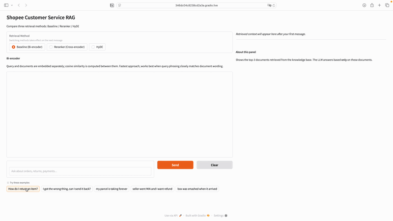

# E-Commerce RAG Customer Service Chatbot

A production-style Retrieval-Augmented Generation (RAG) system for e-commerce customer service, comparing three retrieval strategies with quantitative evaluation.

**Live Demo:** [Link](https://346dc04c8238cd2a3a.gradio.live)

---

```
User Query
    │
    ▼
┌─────────────────────────────────┐
│  Retrieval Strategy             │
│                                 │
│  1  Bi-encoder baseline         │
│  2  + Cross-encoder reranker    │
│  3  HyDE query expansion        │
└─────────────────────────────────┘
    │
    ▼
 Top-3 Documents
    │
    ▼
 LLM (claude-haiku-4-5-20251001 via Anthropic)
    │
    ▼
 Answer
```

## Retrieval Methods

| Method         | How it works                                          |Latency |
|----------------|-------------------------------------------------------|--------|
| **Bi-encoder** | Embed query and docs independently, cosine similarity | ~10ms  |
| **Reranker**   | Bi-encoder top-20 → Cross-encoder rerank → top-3      | ~150ms |
| **HyDE**       | LLM generates hypothetical answer → embed → search    | ~800ms |

```

## Tech Stack

- **LLM:** claude-haiku-4-5-20251001 via Anthropic
- **Embeddings:** `thenlper/gte-small` (HuggingFace)
- **Reranker:** `cross-encoder/ms-marco-MiniLM-L-6-v2`
- **Vector Store:** FAISS
- **Framework:** LangChain (LCEL)
- **UI:** Gradio

## Running the Demo

```bash
# 1. Open any notebook in Google Colab
# 2. Add API_KEY to Colab Secrets (left sidebar → key icon)
# 3. Run all cells top to bottom
# 4. A public Gradio link will be generated valid for 72 hours
```
